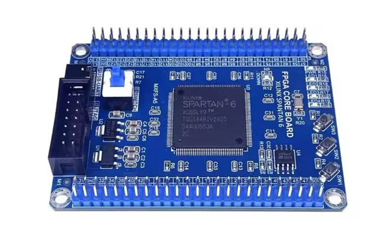
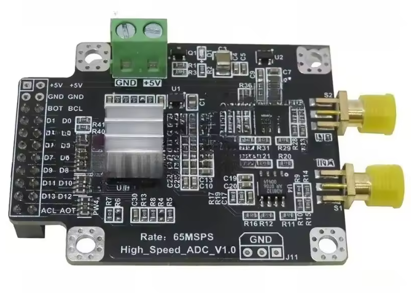

# FPGA-Based Data Acquisition System


A complete FPGA data acquisition project based on a Xilinx Spartan-6 FPGA and an AD9248 14-bit Analog-to-Digital Converter.

The objective of this project is to demonstrate how to build a complete acquisition chain, from an analog signal to real-time visualization on a computer.

The project covers:
* FPGA development using Verilog HDL
* ADC interfacing
* UART communication
* SPI Flash programming
* Python-based visualization
* Hardware and software integration

---

## System Overview

```text
Analog Signal
      │
      ▼
 AD9248 ADC
      │
      ▼
 Spartan-6 FPGA
      │
      ▼
 UART Communication
      │
      ▼
 Python Visualization
```

The FPGA captures samples from the ADC, formats the data into UART packets, and transmits them to a computer where a Python application displays the signal in real time.

---

## Hardware

### Spartan-6 FPGA Development Board

The project is based on a low-cost Spartan-6 development board featuring:
* Xilinx XC6SLX9 FPGA
* 50 MHz onboard oscillator
* USB-UART interface (CH340)
* SPI Flash memory
* JTAG programming support (CH340)



| Parameter | Value |
|-----------|-------|
| Family | Spartan-6 |
| Device | XC6SLX9 |
| Package | TQG144 |
| Speed grade | -2 |
| Onboard clock | 50 MHz |

📦 [Buy on AliExpress](https://fr.aliexpress.com/item/1005008389075810.html)
📄 [Spartan-6 Datasheet](https://docs.amd.com/v/u/en-US/ds160)

> ⚠️ **Driver required (Windows):** This board uses a **CH340** chip for both
> USB-JTAG and USB-UART. Without the driver, Windows will not detect the board.
> Download: https://www.wch-ic.com/downloads/CH341SER_EXE.html
> On Linux, the `ch341` kernel module loads automatically.

---

### AD9248 ADC Module

The acquisition front-end is based on the AD9248, a high-speed 14-bit ADC.



| Parameter | Value |
|-----------|-------|
| Resolution | 14 bits |
| Max sample rate | 65 MSPS |
| Channels | 2 (only channel A routed to connector — see note) |
| Output interface | Parallel CMOS |
| Supply voltage | 3.3 V |

📦 [Buy on AliExpress](https://fr.aliexpress.com/item/1005010066644896.html)
📄 [AD9248 Datasheet](https://www.analog.com/media/en/technical-documentation/data-sheets/AD9248.pdf)

> ⚠️ **Hardware limitation:** Although the AD9248 is dual-channel, on this
> AliExpress module only **channel A** is routed to the output connector.
> Channel B data lines and the SMUX pin are not accessible from the FPGA.

---

### Hardware Setup

The AD9248 board is connected directly to the Spartan-6 FPGA board.

| FPGA pin | Signal | Direction | Description |
|----------|--------|-----------|-------------|
| P55 | clk_50m | Board osc. | 50 MHz system clock |
| P61 | ACL | FPGA → ADC | Channel A sampling clock |
| P62 | BCL | FPGA → ADC | Channel B clock (tied to ACL) |
| P1–P17 | ADC_D[13:0] | ADC → FPGA | 14-bit parallel data bus |
| P126 | uart_tx | FPGA → PC | UART TX to USB-UART adapter |

The FPGA generates the sampling clock, captures the 14-bit ADC output bus,
and sends the acquired data to the PC through the onboard USB-UART interface.

---

## Features

* Verilog FPGA development
* ADC clock generation
* AD9248 data acquisition
* UART communication
* SPI Flash boot configuration
* Python real-time visualization
* Complete educational documentation

---

## Project Goals

This repository is intended both as a working FPGA project and as an educational resource.

By following the documentation, readers will learn how to:
* Configure a Spartan-6 FPGA
* Create Verilog designs
* Interface a parallel ADC
* Implement UART communication
* Program SPI Flash memory
* Transfer data to a computer
* Visualize signals using Python

---

## Repository Structure

```
├── firmware/
│   ├── 01_led_blink/        ← Step 1: blink an LED, validate toolchain
│   ├── 02_uart_tx/          ← Step 2: UART transmitter module
│
