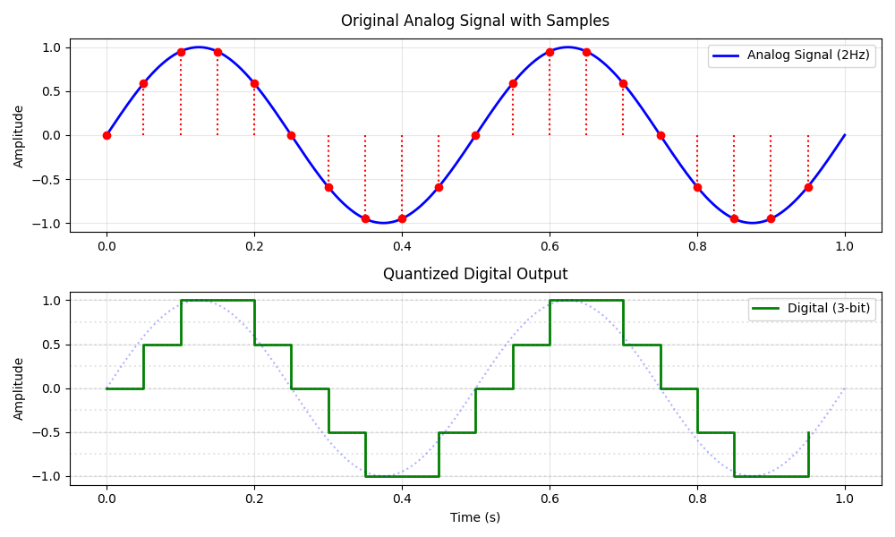
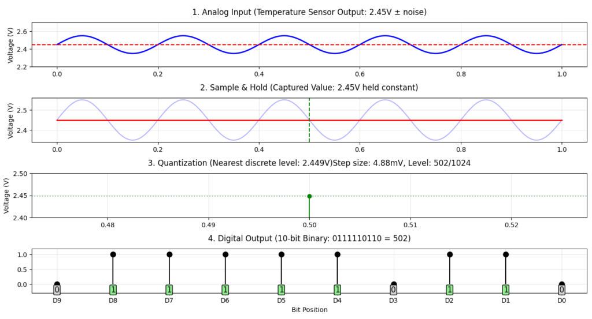
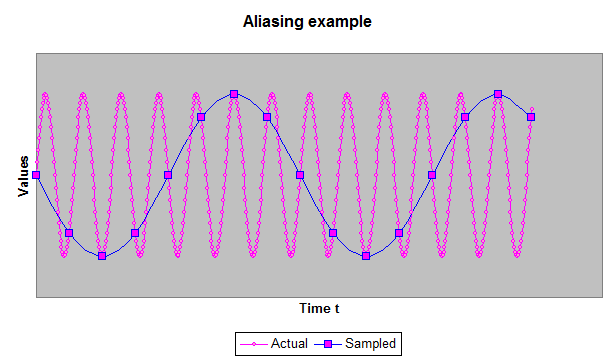

# 01 — What is an ADC?

We know that real-world signals — temperature, sound, voltage from a
function generator — are **analog**: they vary continuously and can take
any value. Digital systems like FPGAs and microcontrollers, however, only
understand binary data (0s and 1s).

This is where the **ADC (Analog-to-Digital Converter)** comes in — it
bridges the gap between the analog and digital worlds, allowing a digital
system to measure and process real-world signals.

In this project, the **AD9248** is the ADC that feeds 14-bit digital
samples into the **Spartan-6 FPGA**.

---

## Key ADC Terms

| Term | Explanation | Example |
|------|-------------|---------|
| **Resolution (bits)** | How finely the ADC divides the analog range | 10-bit → 1 024 levels |
| **Sampling rate** | How many times per second the ADC measures the signal | 1 MSPS → 1 000 000 samples/sec |
| **Reference voltage (Vref)** | The maximum voltage the ADC can measure | Vref = 5 V → input range 0–5 V |
| **Quantization error** | The difference between the real value and its digital approximation | Smaller steps = less error |
| **LSB** | Least Significant Bit — the voltage of one step | 5 V / 1 024 ≈ 4.88 mV |

---

## How ADC Conversion Works — Step by Step


Let's trace a concrete example: converting a **2.45 V** sample from an
analog signal using a 10-bit ADC with a 0–5 V input range.


### 1 — Analog Input

The input is a continuous voltage — for example the output of a
temperature sensor varying around 2.45 V:

```
Input: 2.45 V (analog, continuous)
```

### 2 — Sample & Hold

The ADC samples the signal at a fixed rate. A Sample & Hold circuit
captures and freezes the voltage so it stays stable during conversion:

```
Sampled value: 2.45 V (held constant)
```

### 3 — Quantization

The ADC divides the full input range (5 V, from 0 V to 5 V) into
**1 024 discrete levels** (2¹⁰). Each level corresponds to:

```
Step size = 5 V / 1 024 ≈ 4.88 mV per step
```

The sampled voltage is mapped to the nearest level:

```
2.45 V / 4.88 mV ≈ level 502
```

### 4 — Encoding

The level number is converted to a 10-bit binary word:

```
502 (decimal) = 0111110110 (10-bit binary)
```

### 5 — Digital Output

The digital system reads these 10 bits and can now process, store, or
transmit the value.

```
Digital output: 0111110110
```



---

## ADC Types

| Type | Speed | Resolution | Best for |
|------|-------|-----------|----------|
| **Flash (parallel)** | Very fast | 6–12 bits | Video, RF |
| **Pipeline** | Fast | 10–16 bits | Communications, imaging |
| **SAR** | Medium | 12–18 bits | Microcontrollers, sensors |
| **Delta-Sigma** | Slow | 16–24 bits | Audio, precision |
| **Dual-slope** | Very slow | 12–20 bits | Multimeters |

The **AD9248 is a pipeline ADC**, capable of up to 65 MSPS at 14-bit
resolution — fast enough for RF and instrumentation applications.

---

## The Nyquist Theorem

To correctly reconstruct a signal of frequency **f**, the sampling rate
must be at least **twice** that frequency:

```
Sampling rate ≥ 2 × f_signal
```

If this is violated, **aliasing** occurs — high-frequency signals appear
as false low-frequency components in the captured data.



**In this project:** sampling rate = 1 MSPS → maximum signal frequency = **500 kHz**

```
100 kHz signal → 100 kHz < 500 kHz → correctly captured ✓
600 kHz signal → 600 kHz > 500 kHz → aliased to 400 kHz ✗
```

To prevent aliasing, a **low-pass anti-aliasing filter** is placed before
the ADC input to block any frequency above 500 kHz.

---

## Encoding: Offset Binary (AD9248)

In this project, the AD9248 uses **offset binary** encoding — zero volts
maps to the midpoint of the digital range:

| Input | Binary code | Decimal |
|-------|-------------|---------|
| +Vref (+5 V) | 11 1111 1111 1111 | 16 383 |
| 0 V | 10 0000 0000 0000 | 8 192 |
| −Vref (−5 V) | 00 0000 0000 0000 | 0 |

Reconstructing the original voltage in Python:

```python
def raw_to_volt(raw, vref=5.0):
    return (raw - 8192) * vref / 8192

# raw = 10 443  →  (10 443 − 8 192) × 5.0 / 8 192  =  +1.37 V ✓
```

---

## The AD9248 in This Project

```
ADC                    FPGA
───                    ────
D0  ──────────────────► bit 0  ┐
D1  ──────────────────► bit 1  │
...                            │ 14-bit parallel bus
D13 ──────────────────► bit 13 ┘
ACL ◄────────────────── 1 MHz sampling clock (generated by FPGA)
```

The FPGA drives the sampling clock and captures a new 14-bit sample on
every rising edge. Each sample is packed into a 3-byte UART frame and
streamed to the PC for real-time visualization.

> ⚠️ On this AliExpress AD9248 module, only channel A (D[13:0]) is
> routed to the output connector. Channel B is not accessible.

---

## Summary

| Parameter | Value in this project |
|-----------|----------------------|
| ADC | AD9248 |
| Architecture | Pipeline |
| Resolution | 14 bits — 16 384 levels |
| Sampling rate | 1 MSPS |
| Max signal frequency | 500 kHz (Nyquist limit) |
| Voltage step (LSB) | ~0.61 mV at Vref = 5 V |
| Interface | 14-bit parallel CMOS |
| Encoding | Offset binary |
| Channels used | 1 (channel A only) |

---

## Further Reading

- [AD9248 Datasheet — Analog Devices](https://www.analog.com/media/en/technical-documentation/data-sheets/AD9248.pdf)
- [The Basics of ADC — Anito Circuits](https://anitocircuits.com/the-basics-of-analog-to-digital-conversion-adc/)

---

→ Next: [`02_what_is_an_fpga.md`](fpga.md) — What is an FPGA,
how does it differ from a microcontroller, and why use one for high-speed
ADC interfacing?